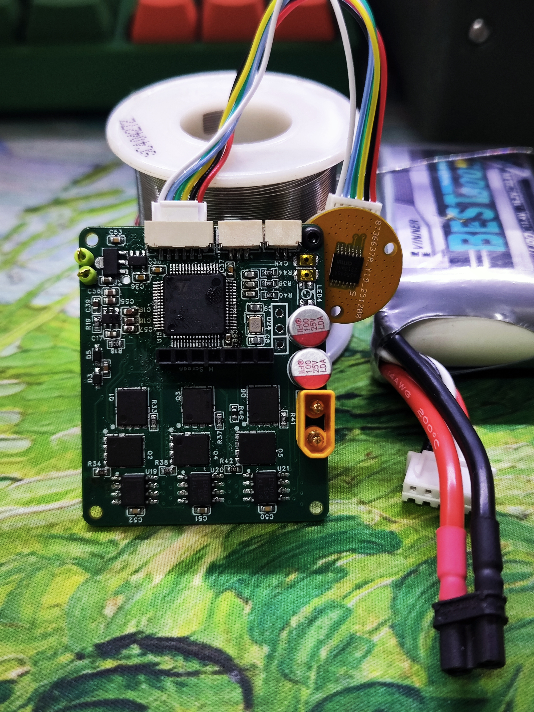

# H_FOC V2.0

<p align="center">
  
</p>

<p align="center">
  面向机器人关节驱动与双关节机械臂实验平台的软硬件一体化项目
</p>

<p align="center">
  
  
  
  
</p>

## 项目简介

`H_FOC V2.0` 面向机器人关节电机控制场景，核心目标是构建一块可用于关节驱动、实验验证和上位机联调的 FOC 控制板，并围绕它形成一整套软件工具链。

- 基于 `STM32G431RBT6` 的 FOC 驱动固件
- 基于 `AS5048A` 的编码器闭环采样
- 基于 `CAN FD` 的主从关节通信协议
- 面向双关节平面机械臂的运动学、示教和重力补偿

## 核心特性

- `20 kHz` PWM / 电流环控制。
- 使用 `AS5048A` 磁编码器，经 `SPI2` 读取角度，并带有角度/速度/加速度观测逻辑。
- 固件内置过压、欠压、过流、过温、编码器异常、采样异常等保护状态机。
- 支持基于 `CAN FD` 的关节状态上报与控制指令下发，协议字段清晰，方便继续扩展。
- MIT 风格控制命令：目标电流、目标角度、目标速度、目标加速度、目标 jerk、刚度、阻尼、控制模式。
- `S-curve` 轨迹规划已在固件中接入；`trapezoidal` 模式接口已预留。
- 上位机侧已经实现双关节机械臂的正逆运动学、点击示教、重力补偿与实时状态显示。
- 仓库附带 `Interactive BOM`、`SolidWorks` 结构文件和关键芯片手册，便于继续做硬件迭代。

## 系统组成

| 模块 | 路径 | 说明 |
| --- | --- | --- |
| 主固件 | [`Code/H_FOC V2.2`](./Code/H_FOC%20V2.2) | 当前重点版本，包含 FOC、编码器、CAN FD、轨迹规划与保护逻辑 |
| 旧版固件 | [`Code/H_FOC V2.1`](./Code/H_FOC%20V2.1) | 保留的历史版本，可用于对比迭代 |
| Qt 上位机 | [`Code/H_FOC_Robot_App/H_FOC_Robot_App`](./Code/H_FOC_Robot_App/H_FOC_Robot_App) | 双关节机械臂界面、CAN FD 通信、运动学与控制参数配置 |
| 交互式 BOM | [`InteractiveBOM_PCB1_2025-12-18.html`](./InteractiveBOM_PCB1_2025-12-18.html) | 浏览器打开 |
| 结构模型 | [`结构`](./结构) | `SolidWorks` 结构文件 |
| 芯片资料 | [`相关芯片手册`](./相关芯片手册) | MCU、编码器等资料归档 |
| 设计说明 | [`H_FOC V2.0.docx`](./H_FOC%20V2.0.docx) | 板卡引脚与说明文档 |

## 固件概览

主固件位于 [`Code/H_FOC V2.2`](./Code/H_FOC%20V2.2)，从代码可以确认它的核心特征包括：

- 主控：`STM32G431RBT6`
- 主频：`170 MHz`
- PWM 频率：`20 kHz`
- 编码器：`AS5048A`
- 通信：`FDCAN1`
- 串口调试：`USART3`
- 控制参数配置集中在 [`APP/Config.h`](./Code/H_FOC%20V2.2/APP/Config.h)
- 工程入口：
  - Keil 工程：[`MDK-ARM/H_FOC V2.0.uvprojx`](./Code/H_FOC%20V2.2/MDK-ARM/H_FOC%20V2.0.uvprojx)
  - CubeMX 工程：[`H_FOC V2.0.ioc`](./Code/H_FOC%20V2.2/H_FOC%20V2.0.ioc)

默认参数中可直接读到以下安全/控制边界：

| 项目 | 默认值 |
| --- | --- |
| 母线电压限制 | `30.0 V` |
| 最大相电流 | `5.5 A` |
| 欠压阈值 | `9.0 V` |
| 过温阈值 | `60.0 °C` |

## 通信协议摘要

### CAN FD

固件与上位机当前使用的协议要点如下：

- 标准 `11-bit CAN ID` 组织方式：`(src << 8) | (dst << 4) | type`
- 主节点 ID：`0`
- 默认关节节点：`1 / 2`
- 广播地址：`0x0F`
- 仲裁段速率：`1 Mbps`
- 数据段速率：`2 Mbps`
- 定点缩放：`1e-5`

状态帧 `STATUS` 负载：

| 字段 | 类型 |
| --- | --- |
| 位置 | `int32` |
| 速度 | `int32` |
| 电流 | `int32` |
| 温度 | `int32` |
| 加速度 | `int32` |

控制帧 `CONTROL` 负载：

| 字段 | 类型 |
| --- | --- |
| target_current | `int32` |
| target_angle | `int32` |
| target_velocity | `int32` |
| target_acceleration | `int32` |
| target_jerk | `int32` |
| stiffness | `int32` |
| damping | `int32` |
| control_mode | `uint8` |

## 上位机与工具链

### 1. Qt6 机器人上位机

路径：[`Code/H_FOC_Robot_App/H_FOC_Robot_App`](./Code/H_FOC_Robot_App/H_FOC_Robot_App)

特性：

- `Qt 6.5+`
- 使用 `Qt Widgets + Qt SerialPort`
- 双关节机械臂工作区可视化
- 点击画布设置末端目标点
- 实时显示目标位置、当前姿态、关节角速度、电流与通信状态
- 提供 `normal / trapezoidal / s_curve` 控制模式选项，当前固件侧重点接入的是 `normal / s_curve`
- 可配置刚度、阻尼、速度、加速度、jerk

默认串口/CAN FD 参数集中在：

- [`core/appconfig.h`](./Code/H_FOC_Robot_App/H_FOC_Robot_App/core/appconfig.h)

## 快速开始

### 固件

1. 打开 [`Code/H_FOC V2.2/MDK-ARM/H_FOC V2.0.uvprojx`](./Code/H_FOC%20V2.2/MDK-ARM/H_FOC%20V2.0.uvprojx)
2. 根据硬件修改 [`Code/H_FOC V2.2/APP/Config.h`](./Code/H_FOC%20V2.2/APP/Config.h)
3. 通过VS Code EIDE或者MDK编译并下载到 `STM32G431RBT6`

### Qt 上位机

```powershell
cd "Code/H_FOC_Robot_App/H_FOC_Robot_App"
cmake -S . -B build
cmake --build build --config Release
```

依赖：

- `Qt 6.5+`
- `Qt SerialPort`
- 支持 `slcan`/串口桥接的 CAN FD 适配器

## 设计资料

- 板卡外观图：[`H_FOC_V2.0_image.jpg`](./H_FOC_V2.0_image.jpg)
- 交互式 BOM：[`InteractiveBOM_PCB1_2025-12-18.html`](./InteractiveBOM_PCB1_2025-12-18.html)
- 结构模型：[`结构`](./结构)
- 芯片手册：[`相关芯片手册`](./相关芯片手册)
- 设计说明：[`H_FOC V2.0.docx`](./H_FOC%20V2.0.docx)

<details>
<summary>展开查看板卡主要引脚摘要</summary>

- ADC 采样：`PC0 / PC1 / PC2 / PC3` = `VA / VB / VC / VBUS`
- 电流采样：`PA0 / PA1 / PA2` = `IA / IB / IC`
- 温度：`PC4`
- 三相驱动高端：`PC6 / PC7 / PC8`
- 三相驱动低端：`PC10 / PC11 / PC12`
- 编码器：`PB12 / PB13 / PB14 / PB15`
- 调试 DAC：`PA4 / PA5`
- 调试串口：`PB10 / PB11`
- 屏幕接口：`PB3 / PB5 / PB6 / PB7 / PA15`
- CAN：`PB8 / PB9`
- 按键：`PA8 / PA9`
- 三色灯：`PB0 / PB1 / PB2`

</details>
